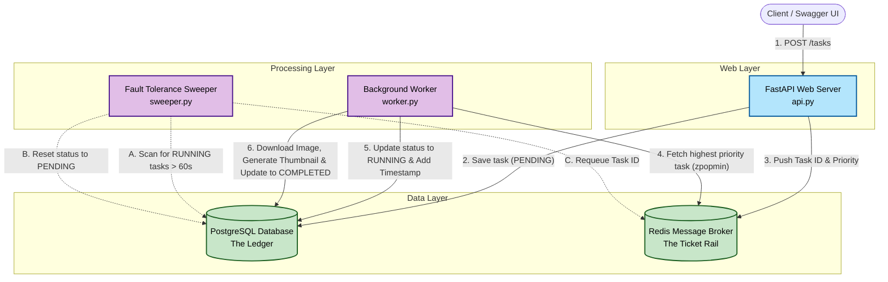

# Distributed Task Scheduler

A decoupled, highly available, and fault-tolerant distributed system built to handle asynchronous background processing. The worker downloads images from URLs and generates compressed 128x128 JPEG thumbnails, demonstrating real task execution alongside core system design principles like message brokering, concurrent worker nodes, and automated failure recovery.

## System Architecture

The system is broken down into three decoupled layers: a web ingestion layer, a fast in-memory queue, and a horizontally scalable processing layer. 



## Key Features

**Real Task Execution (Image Compression):**  
The worker downloads images from URLs, resizes them to 128x128 thumbnails using Pillow, and saves compressed JPEGs to disk — demonstrating actual I/O-bound distributed work, not simulated delays.

**Asynchronous Processing:**  
Offloads heavy computational tasks from the main API thread to isolated background workers, ensuring immediate HTTP response times.

**Concurrency Control:**  
Utilizes Redis atomic operations (`zpopmin`) to safely distribute prioritized tasks across multiple worker nodes without race conditions or duplicate execution.

**Self-Healing Fault Tolerance:**  
Implements a dedicated background "Sweeper" process to detect orphaned or crashed tasks (Ghost Tasks) and automatically requeue them, ensuring 100% task completion.

**Error Handling:**  
Failed tasks are marked with a `FAILED` status and the error message is stored in the `result` field for debugging, instead of silently disappearing.

---

## Tech Stack

- **Web Framework:** FastAPI, Uvicorn  
- **Database / Persistence:** PostgreSQL, SQLAlchemy (ORM)  
- **Message Broker:** Redis  
- **Image Processing:** Pillow (PIL)  
- **Containerization:** Docker, Docker Compose  
- **Language:** Python 3.11+

---

## Quick Start (Docker)

Run the entire distributed system with a single command — no manual setup required.

### Prerequisites
- [Docker Desktop](https://www.docker.com/products/docker-desktop/) installed and running.

### Launch
```bash
git clone https://github.com/Parth7234/distributed-task-scheduler.git
cd distributed-task-scheduler
docker compose up --build
```

This starts **5 containers**: PostgreSQL, Redis, the API server, a background Worker, and the fault-tolerance Sweeper.

### Test it
Open the Swagger UI at **http://localhost:8000/docs**

**Submit an image compression task:**
```bash
curl -X POST http://localhost:8000/tasks \
  -H "Content-Type: application/json" \
  -d '{"priority": 1, "description": "https://images.unsplash.com/photo-1503023345310-bd7c1de61c7d"}'
```

**Check the queue:**
```bash
curl http://localhost:8000/tasks
```

The worker will automatically download the image, generate a 128x128 thumbnail, and mark the task as `COMPLETED`.

**View generated thumbnails:**
```bash
docker compose exec worker ls /app/thumbnails/
```

### Stop
```bash
docker compose down
```

---

## Manual Setup (Without Docker)

### 1. Prerequisites
Ensure you have Python 3.11+ installed. You will also need local instances of PostgreSQL and Redis running.

```bash
brew services start postgresql@<your_version>
brew services start redis
````

### 2. Environment Setup

Clone the repository and install the required dependencies in a virtual environment:

```bash
python3 -m venv venv
source venv/bin/activate
pip install -r requirements.txt
```

### 3. Running the System

To see the distributed system in action, open three separate terminal windows (ensure your virtual environment is activated in all three).

**Terminal 1 (The API Server):**

```bash
uvicorn api:app --reload
```

**Terminal 2 (The Background Worker):**

```bash
python3 worker.py
```

**Terminal 3 (The Fault Tolerance Manager):**

```bash
python3 sweeper.py
```

### 4. Testing the API

Once the system is running, navigate to the auto-generated Swagger UI documentation to submit tasks and monitor the queue:

http://127.0.0.1:8000/docs
