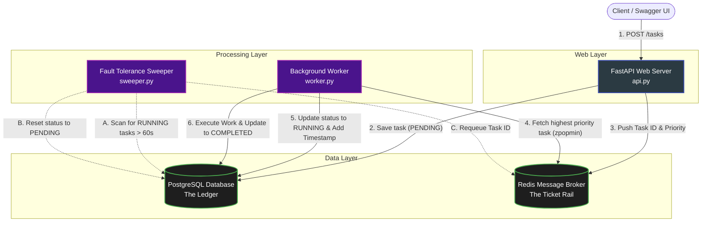

# Distributed Task Scheduler

A decoupled, highly available, and fault-tolerant distributed system built to handle asynchronous background processing. This project demonstrates core system design principles, including message brokering, concurrent worker nodes, and automated failure recovery.

## 🏗 System Architecture

The system is broken down into three decoupled layers: a web ingestion layer, a fast in-memory queue, and a horizontally scalable processing layer. 



## ✨ Key Engineering Features

**Asynchronous Processing:**  
Offloads heavy computational tasks from the main API thread to isolated background workers, ensuring immediate HTTP response times.

**Concurrency Control:**  
Utilizes Redis atomic operations (`zpopmin`) to safely distribute prioritized tasks across multiple worker nodes without race conditions or duplicate execution.

**Self-Healing Fault Tolerance:**  
Implements a dedicated background "Sweeper" process to detect orphaned or crashed tasks (Ghost Tasks) and automatically requeue them, ensuring 100% task completion.

---

## 🛠 Tech Stack

- **Web Framework:** FastAPI, Uvicorn  
- **Database / Persistence:** PostgreSQL, SQLAlchemy (ORM)  
- **Message Broker:** Redis  
- **Language:** Python 3.11+

---

## 🚀 Local Setup & Installation

### 1. Prerequisites
Ensure you have Python 3.11+ installed. You will also need local instances of PostgreSQL and Redis running.

```bash
brew services start postgresql@<your_version>
brew services start redis
````

### 2. Environment Setup

Clone the repository and install the required dependencies in a virtual environment:

```bash
python3 -m venv venv
source venv/bin/activate
pip install -r requirements.txt
```

### 3. Running the System

To see the distributed system in action, open three separate terminal windows (ensure your virtual environment is activated in all three).

**Terminal 1 (The API Server):**

```bash
uvicorn api:app --reload
```

**Terminal 2 (The Background Worker):**

```bash
python3 worker.py
```

**Terminal 3 (The Fault Tolerance Manager):**

```bash
python3 sweeper.py
```

### 4. Testing the API

Once the system is running, navigate to the auto-generated Swagger UI documentation to submit tasks and monitor the queue:

👉 http://127.0.0.1:8000/docs
